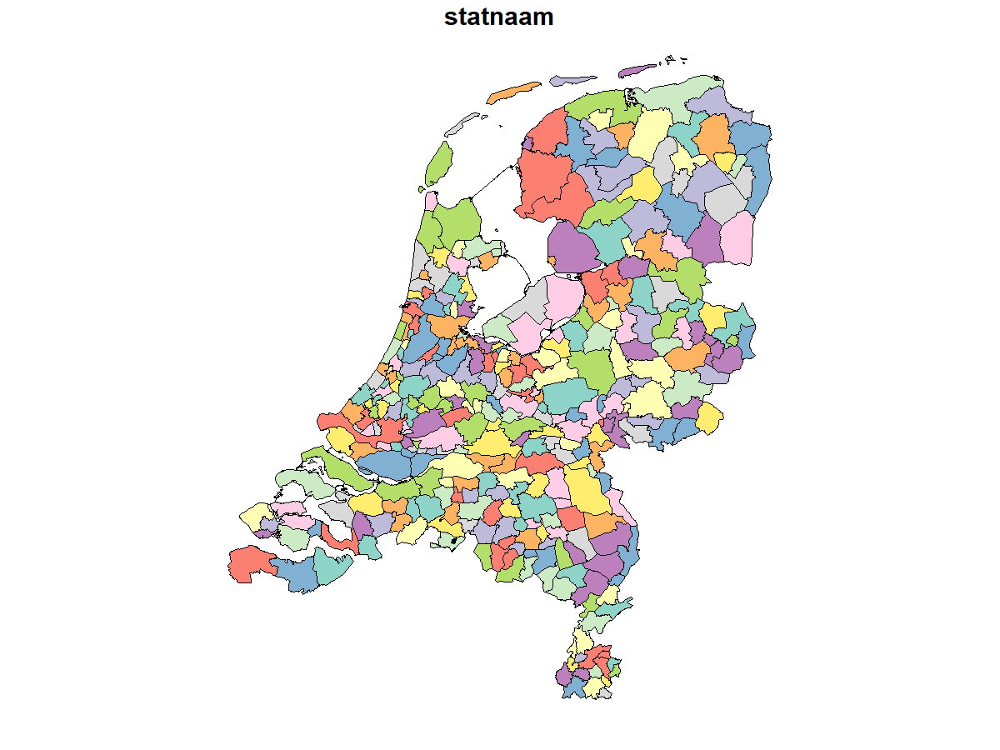
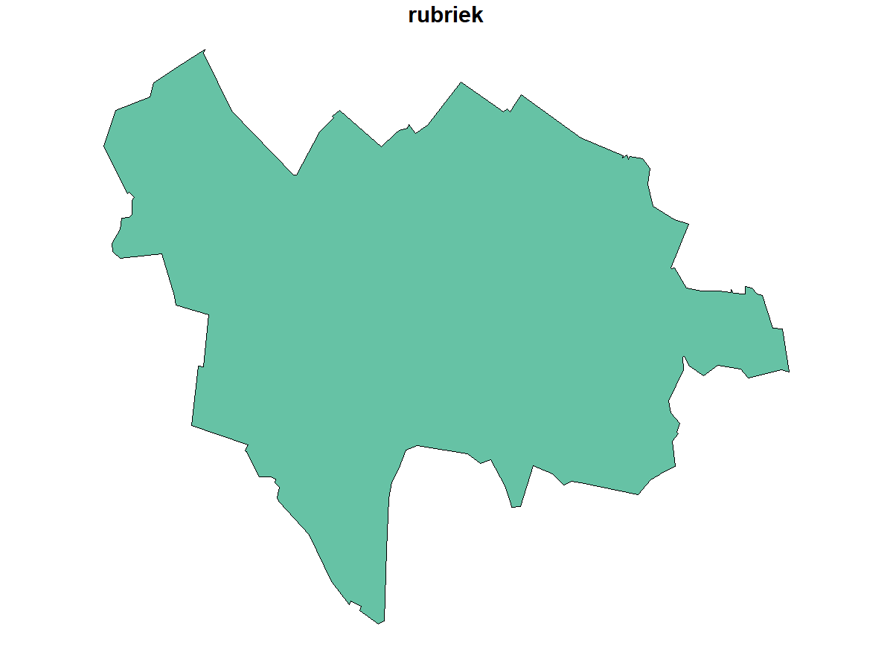
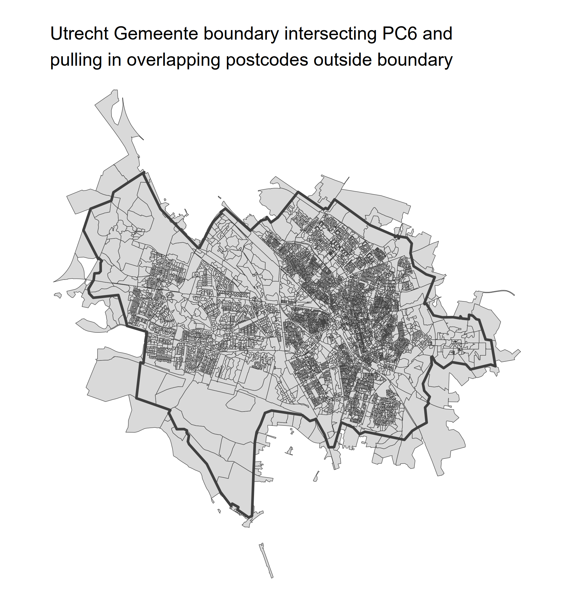
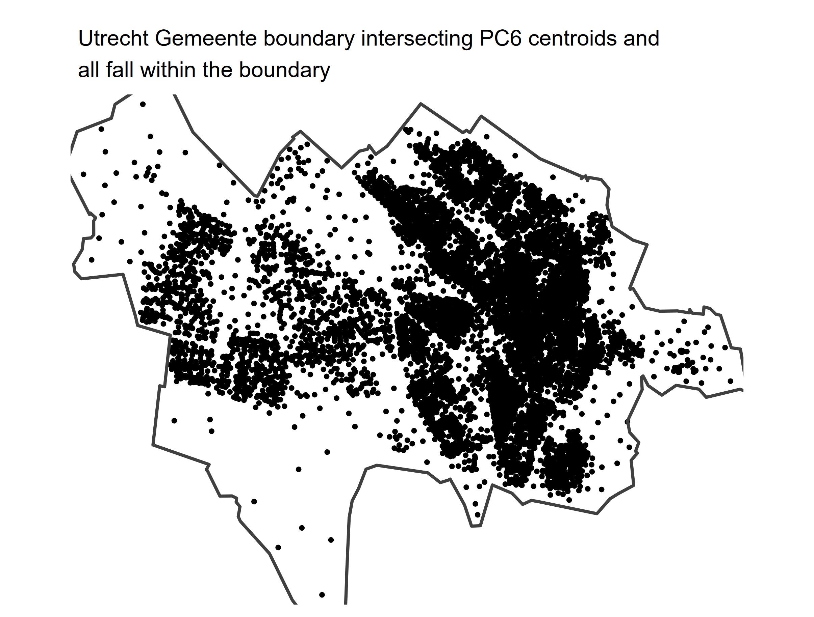
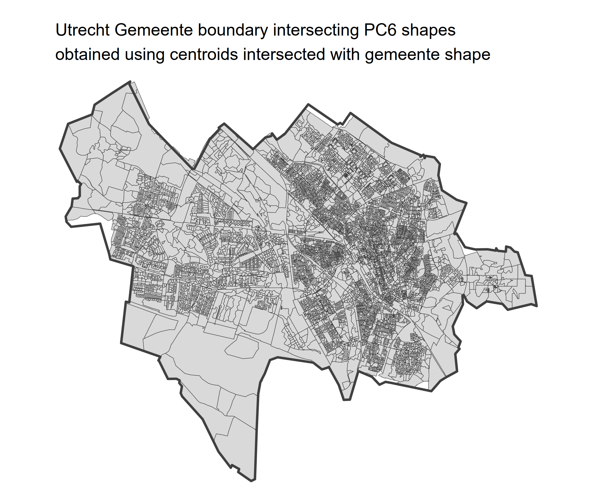
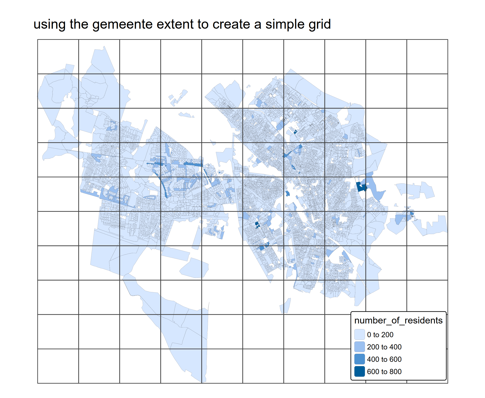
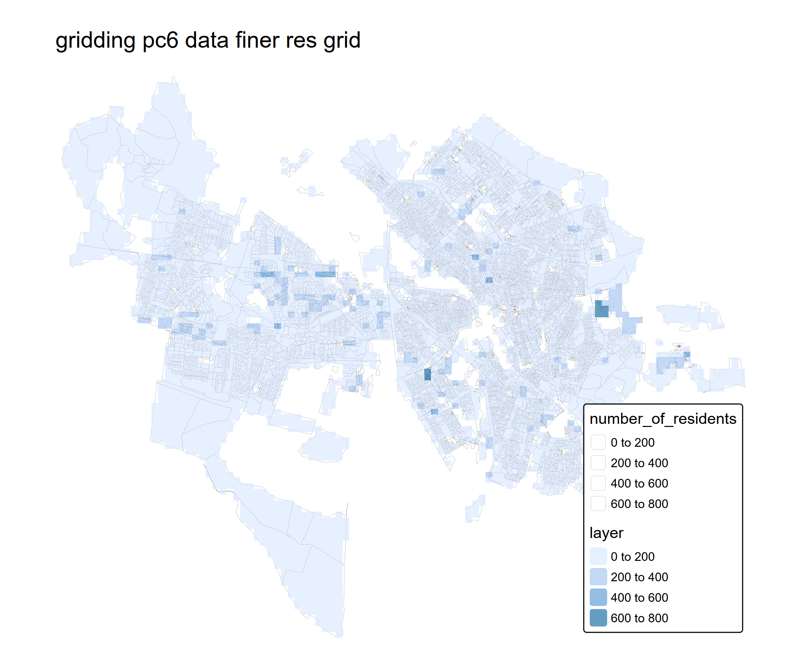
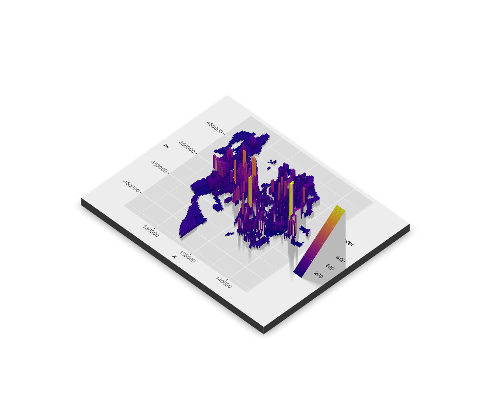
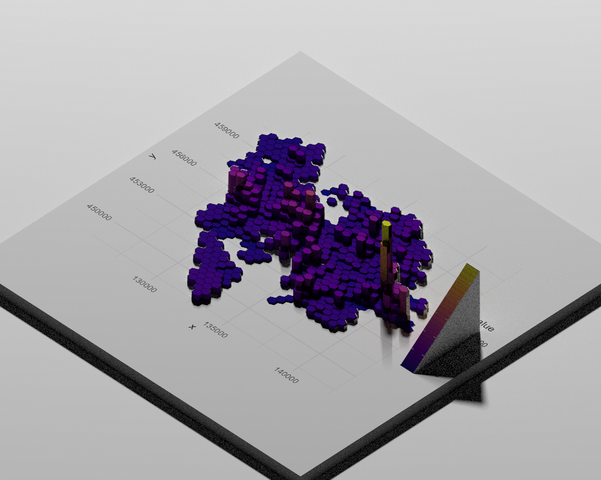

# CBS PC6 example plots


The script “example.R” downloads the open access CBS PC6 shapefile data
which comes with around 130 additional datapoints for each postcode. It
trims to a gemeente and grids the data to a custom grid and plots as a
3d rayshader plot.

``` r
library(sf)
library(raster)
library(ggplot2)
library(dplyr)
library(mapview)
library(polyglotr)
library(httr)
library(rayshader)

# create directory for data download, make sure your working directory is where this script is saved first, in the menu above go to "Session-Set working directory-to source file location"
dir.create("data/")
dir.create("plots/")

download.file("https://download.cbs.nl/postcode/2025-cbs_pc6_2024_v1.zip", destfile = "data/2025-cbs_pc6_2024_v1.zip")

unzip("data/2025-cbs_pc6_2024_v1.zip", exdir = "data/")

# read in the unzipped shape file
pc6 <- st_read("data/cbs_pc6_2024_v1.gpkg")

# you now have a variable in the environment. It is just like spreadsheet table, but with a column (geom) with the shape data
# Each row represents a PC6 shape (i.e. your postcode is PC6 (6 characters))

# however, the headers are in dutch, so get the headers from the data frame
pc6_colnames <- names(pc6)

# and translate them
headers_en <- polyglotr::google_translate(text = pc6_colnames, target_language = "en")

# have a look at them
headers_en
```

The data available for each PC6 postcode

\[1\] “postcode6” “number_of_residents”  
\[3\] “number_of_men” “number_women”  
\[5\] “number_inhabitants_0_to_15_years”
“number_inhabitants_15_to_25_years”  
\[7\] “number_inhabitants_25_to_45_years”
“number_inhabitants_45_to_65_years”  
\[9\] “number_inhabitants_65_years_and_older” “number_births”  
\[11\] “percentage_birth_Netherlands_origin_Netherlands”
“percentage_birth_Netherlands_origin_other_Europe”  
\[13\] “percentage_origin_netherlands_origin_outside_europe”
“percentage_occupancy_outside_the Netherlands_origin_Europe”  
\[15\] “percentage_habit_outside_the Netherlands_herkmst_outside_Europe”
“number_part_households”  
\[17\] “number_single-person households”
“number_of_multi-person_households_without_child”  
\[19\] “number_single-parenthouseholds” “number_of_two-parent
households”  
\[21\] “average_household size” “number_of_homes”  
\[23\] “number_of_homes_built_year_before_1945”
“number_of_homes_construction_year_45_to_65”  
\[25\] “number_of_homes_construction_year_65_to_75”
“number_of_homes_construction_year_75_to_85”  
\[27\] “number_of_homes_construction_year_85_to_95”
“number_of_homes_built_year_95_to_05”  
\[29\] “number_of_homes_construction_year_05_to_15”
“number_of_homes_construction_year_15_and_later”  
\[31\] “number_of_multi-family_homes” “percentage_owner-occupied
homes”  
\[33\] “percentage_rental properties”
“number_of_rental_homes_owned_by_housing_corporations”  
\[35\] “number of_not_inhabited_homes” “average_woz_value_home”  
\[37\] “average_gas_consumption_home”
“average_electricity_consumption_home”  
\[39\] “number_of_persons_with_benefit_under_aowlft”
“nearest_major_supermarket_distance_in_km”  
\[41\] “large_supermarket_number_within_1_km”
“large_supermarket_number_within_3_km”  
\[43\] “large_supermarket_number_within_5_km”
“nearest_shops_ov_dayel_levensm_dist_in_km”  
\[45\] “shops_ov_day_lifem_number_within_1_km”
“shops_ov_day_lifem_number_within_3_km”  
\[47\] “shops_ov_day_lifem_number_within_5_km”
“nearest_department_store_distance_in_km”  
\[49\] “department store_number_within_5_km” “department
store_number_within_10_km”  
\[51\] “department store_number_within_20_km”
“nearest_cafe_distance_in_km”  
\[53\] “cafe_number_within_1_km” “cafe_number_within_3_km”  
\[55\] “cafe_number_within_5_km” “nearest_cafeteria_distance_in_km”  
\[57\] “cafeteria_number_within_1_km” “cafeteria_number_within_3_km”  
\[59\] “cafeteria_number_within_5_km” “nearest_hotel_distance_in_km”  
\[61\] “hotel_number_within_5_km” “hotel_number_within_10_km”  
\[63\] “hotel_number_within_20_km” “nearest_restaurant_distance_in_km”  
\[65\] “restaurant_number_within_1_km” “restaurant_number_within_3_km”  
\[67\] “restaurant_number_within_5_km”
“nearest_out-of-school_care_distance_in_km”  
\[69\] “out-of-school_care_number_within_1_km”
“out-of-school_care_number_within_3_km”  
\[71\] “out-of-school_care_number_within_5_km”
“nearest_daycare_distance_in_km”  
\[73\] “daycare center_number_within_1_km” “daycare
center_number_within_3_km”  
\[75\] “daycare center_number_within_5_km” “nearest_fire
station_distance_in_km”  
\[77\] “nearest_ramp_main_road_distance_in_km”
“nearest_transfer_station_distance_in_km”  
\[79\] “nearest_trainstation_distance_in_km”
“nearest_theme_park_distance_in_km”  
\[81\] “amusement park_number_within_10_km” “amusement
park_number_within_20_km”  
\[83\] “amusement park_number_within_50_km”
“nearest_cinema_distance_in_km”  
\[85\] “cinema_number_within_5_km” “cinema_number_within_10_km”  
\[87\] “cinema_number_within_20_km” “nearest_museum_distance_in_km”  
\[89\] “museum_number_within_5_km” “museum_number_within_10_km”  
\[91\] “museum_number_within_20_km” “nearest_theater_distance_in_km”  
\[93\] “theater_number_within_5_km” “theater_number_within_10_km”  
\[95\] “theater_number_within_20_km” “nearest_library_distance_in_km”  
\[97\] “nearest_artificial_rink_distance_in_km” “nearest_pop
venue_distance_in_km”  
\[99\] “nearest_sauna_distance_in_km” “nearest_sunbed_distance_in_km”  
\[101\] “nearest_pool_distance_in_km”
“nearest_primary_education_distance_in_km”  
\[103\] “primary education_number_within_1_km” “primary
education_number_within_3_km”  
\[105\] “primary education_number_within_5_km”
“nearest_havo_vwo_distance_in_km”  
\[107\] “havo_vwo_number_within_3_km” “havo_vwo_number_within_5_km”  
\[109\] “havo_vwo_number_within_10_km”
“nearest_pre-vocational_distance_in_km”  
\[111\] “vmbo_number_within_3_km” “vmbo_number_within_5_km”  
\[113\] “vmbo_number_within_10_km”
“nearest_secondary_education_distance_in_km”  
\[115\] “secondary_education_number_within_3_km”
“secondary_education_number_within_5_km”  
\[117\] “secondary_education_number_within_10_km”
“nearest_GP_practice_distance_in_km”  
\[119\] “GP practice_number_within_1_km” “GP
practice_number_within_3_km”  
\[121\] “GP practice_number_within_5_km”
“nearest_sick_h_excl_outside_poli_dist_in_km”  
\[123\] “hospital_excl_outside_poli_number_inside_5_km”
“hospital_excl_outside_poli_number_inside_10_km”  
\[125\] “hospital_excl_outside_poli_number_inside_20_km”
“nearest_sick_incl_outside_poli_dist_in_km”  
\[127\] “hospital_incl_outsidepoli_number_inside_5_km”
“hospital_incl_outsidepoli_number_inside_10_km”  
\[129\] “hospital_incl_outsidepoli_number_inside_20_km”
“nearest_pharmacy_distance_in_km”  
\[131\] “nearest_GP post_distance_in_km”

``` r
# replace the headers with english versions
names(pc6) <- headers_en

# but it is a huge amount of data let's so trim it

# first load in some dutch shapes
list_of_geos <- c("landsdeel", "provincie", "coropgebied", "gemeente")

## choose year and geometry
for (geo_nam in list_of_geos){

  url <- parse_url("https://service.pdok.nl/cbs/gebiedsindelingen/2023/wfs/v1_0")
  url$query <- list(service = "WFS",
                    version = "2.0.0",
                    request = "GetFeature",
                    typename = paste0("gebiedsindelingen:", geo_nam, "_gegeneraliseerd"),
                    outputFormat = "application/json")
  request <- build_url(url)

  geo_sf <- st_read(request, quiet = TRUE)

  assign(geo_nam, geo_sf)

}

# there are now 4 geospatial variables in your environment, these are the 4 main ways of dividing NL
plot(gemeente)
```



``` r
# lets pick out Utrecht
utrecht <- filter(gemeente, statnaam == "Utrecht")
```



``` r
# and trim the data to it. This bit of code is basically comparing the geo columns in each file and picking out the ones that overlap
# putting pc6 first means we want this data that overlaps with utrecht, if we swapped it it would pick out gemeente that overlapped with pc6 (which would be all of them)
utrecht_pc6 <- pc6[utrecht,]
```



``` r
#is a bit messy because it is working on the outside of the shapes and pc6 areas that are outside also touch utrecht
#best to use the pc6 centre points i.e. the middle of each pc6
pc6_centroids <- st_centroid(pc6)

# do the same intersection
utrecht_pc6_cent <- pc6_centroids[utrecht,]

# now they all fit, but we only have dots
```



``` r
# use the dot data to pick out the pc6 shapes
pc6_utrecht <- filter(pc6, postcode6 %in% utrecht_pc6_cent$postcode6)

# looks nice
```



``` r
# can view the data, just include a column heading in the quotation bit
mapview(pc6_utrecht['number_of_residents'])

# say we wanted to grid this data
# get min and max coordinates of utrecht - called the extent
utrecht_ext <- extent(utrecht)

## generate desired raster (grid)
r <- raster(nrows=10, ncols=10, xmn=utrecht_ext[1], xmx=utrecht_ext[2], ymn=utrecht_ext[3], ymx=utrecht_ext[4],
            crs = 28992)

r_poly <- st_as_sf(rasterToPolygons(r))

# show how the raster grid looks like compared to the shapes
```



``` r
pc6_utrecht_n_res <- pc6_utrecht |>
  select(number_of_residents, geom) |>
  filter(number_of_residents >= 0)

# rasterize number of residents column the shape to the grid.
pc6_utrecht_gridded <- raster::rasterize(pc6_utrecht_n_res, r, "number_of_residents")

# quick plot
plot(pc6_utrecht_gridded)
```


``` r
## generate desired raster (grid)
r_high_res <- raster(nrows=100, ncols=100, xmn=utrecht_ext[1], xmx=utrecht_ext[2], ymn=utrecht_ext[3], ymx=utrecht_ext[4],
            crs = 28992)

# grid the number of residents column from the pc6 data using the high res raster grid
hr_r <- terra::rasterize(pc6_utrecht_n_res, r_high_res, "number_of_residents")
```



``` r
# convert raster to an xyz dataframe i.e. every centre point of each grid x,y and z is the value of the cell
r_xyz <- data.frame(rasterToPoints(hr_r))

# 2d plot
pp = ggplot(r_xyz, aes(x = x, y = y)) +
  geom_raster(aes(x = x, y = y, fill = layer)) +
  scale_fill_viridis_c(option = "C")

# plot in 3d
par(mfrow = c(1, 2))
plot_gg(pp, width = 5, height = 4, scale = 300, raytrace = FALSE, preview = TRUE)
plot_gg(pp, width = 5, height = 4, scale = 300, multicore = TRUE, windowsize = c(1000, 800))

# save as a simple render
render_snapshot(filename = "plots/grid_render.png")
```

 Plot as a hex grid instead

``` r
# do a hex plot of the same data
pp <- ggplot(r_xyz, aes(x = x, y = y, z = layer)) +
  stat_summary_hex(aes(fill = ..value..),
                   fun = mean, bins = 30, colour = "black", size = 0.2) +
  scale_fill_viridis_c(option = "C") +
  coord_equal(ratio = 1) +
  theme_minimal() +
  theme(
    panel.background = element_rect(fill = "white", colour = NA),
    plot.background  = element_rect(fill = "white", colour = NA)
  )

# how is it looking?
pp

# now in 3D
plot_gg(pp,
        width = 6, height = 6,
        scale = 300,
        multicore = TRUE,
        windowsize = c(1000, 800),
        zoom = 0.6, phi = 40, theta = 45)

# do a high quality render
render_highquality(
  filename = "plots/hex_render.png",
  environment_light = "white",
  light = TRUE,
  samples = 200
)
```


